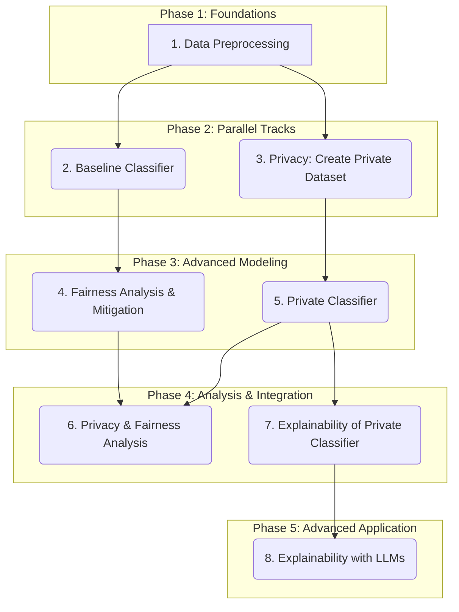

# Project Plan: Responsible Data Science

This document outlines a strategic plan for the "Responsible Data Science" project. It breaks down the project into phases, identifies task dependencies, and suggests a workflow that allows for both sequential and parallel execution by a team of six.

## Core Concepts & Task Dependencies

The project can be broken down into several core modules.

---

## Proposed Project Phases & Workflow

### Phase 1: Data Foundation (Sequential)

**Goal:** Prepare the dataset that all subsequent tasks will use. This phase must be completed before any other modeling work can begin.

* **Task 1: Data Preprocessing**
  * **Description:** Load the Adult dataset, perform initial cleaning, and binarize the 'Age' feature as required.
  * **Output:** A clean, preprocessed dataset.
  * **Team Allocation:** 1-2 members.

### Phase 2: Parallel Initial Modeling (Parallel Tracks)

Once the data is preprocessed, the team can split into two parallel tracks.

* **Track A - Task 2: Baseline & Fairness Track**
  * **Description:**
    1. Split the preprocessed data into training, validation, and test sets.
    2. Train the initial `classifier`.
    3. Evaluate its performance.
    4. Assess the group fairness of this `classifier` using 'Age' and 'Sex' as protected attributes.
    5. Research and select a suitable fairness mitigation technique.
  * **Output:** A trained `classifier`, its performance metrics, and a fairness assessment report.
  * **Team Allocation:** 2 members.

* **Track B - Task 3: Privacy Track**
  * **Description:**
    1. Using the preprocessed data, compute the initial cross-tabulation for 'Age' and 'Sex'.
    2. Apply Local Differential Privacy (LDP) to create the `private dataset`. Experiment with different epsilon (ε) values.
    3. Compute the cross-tabulation on the private data and quantify estimation errors.
  * **Output:** A `private dataset` and an analysis of privacy's impact on data representation.
  * **Team Allocation:** 2 members.

### Phase 3: Advanced Modeling (Parallel Tracks)

These tasks build directly on the outputs of Phase 2.

* **Track A - Task 4: Fair Classifier**
  * **Dependency:** Task 2 (Baseline & Fairness)
  * **Description:** Apply the chosen mitigation technique to create the `fair classifier`. Report and compare its fairness metrics against the original `classifier`.
  * **Output:** A trained `fair classifier` and a comparative fairness analysis.
  * **Team Allocation:** Same 2 members from Track A.

* **Track B - Task 5: Private Classifier**
  * **Dependency:** Task 3 (Privacy)
  * **Description:** Split the `private dataset` and train the `private classifier`. Report its performance and compare it to the baseline `classifier`.
  * **Output:** A trained `private classifier` and a performance comparison report.
  * **Team Allocation:** Same 2 members from Track B.

### Phase 4: Analysis and Integration (Sequential & Parallel)

This phase focuses on combining the concepts of privacy, fairness, and explainability.

* **Task 6: Privacy and Fairness Combined**
  * **Dependencies:** Task 4 (Fair Classifier) & Task 5 (Private Classifier)
  * **Description:**
    1. Create the `private+fair classifier` using the private dataset and the fairness mitigation technique.
    2. As an auditor, use the *true* protected attributes to measure the fairness of this new model.
    3. Compare the results with the `fair classifier` and draw conclusions.
  * **Team Allocation:** 1-2 members (can be from Track A or B).

* **Task 7: Explainability of the Private Classifier**
  * **Dependency:** Task 5 (Private Classifier)
  * **Description:**
    1. Study the explainability of the `private classifier`.
    2. Identify and analyze instances where the model is wrong but highly confident.
    3. Investigate if the noisy private attributes are a contributing factor to these errors.
  * **Team Allocation:** 1-2 members. This can be done in parallel with Task 6.

### Phase 5: Advanced Applications & Finalization (Parallel)

This final phase can be worked on in parallel with other tasks once the necessary models are available.

* **Task 8: Explainability with LLMs**
  * **Dependency:** A trained model (e.g., `private classifier` from Task 5).
  * **Description:**
    1. Choose an explainability method (e.g., SHAP, LIME).
    2. Develop a natural language interface to present explanations.
    3. Use an LLM (like one from LM Studio) to translate model explanations into human-friendly text.
  * **Team Allocation:** 1-2 members. This is a great task for members with an interest in NLP and can start as soon as a model is ready to be explained.

* **Task 9: Reporting and Presentation**
  * **Description:** Consolidate all findings, analyses, and choices into the final report and presentation slides. This is an ongoing task but will ramp up as other tasks are completed.
  * **Team Allocation:** All members contribute, with 1-2 leading the consolidation.

## Team Allocation Summary

* **Team 1 (2 members):** Focus on the Fairness track (Tasks 2A, 4). Can later assist with Task 6 or 9.
* **Team 2 (2 members):** Focus on the Privacy track (Tasks 2B, 5). Can later assist with Task 6 or 9.
* **Team 3 (2 members):** Can start with foundational work (Task 1), then move to Explainability (Task 7 & 8).
